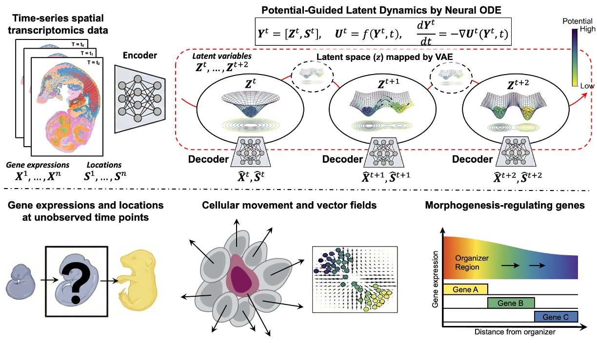

# STODE

STODE is a deep generative framework that integrates a VAE with a potential-guided neural ODE to reconstruct continuous spatiotemporal dynamics from time-series spatial transcriptomics.

---

## Overview

<p align="center">
  
</p>

---

## Quick start

1. **Preprocess data**

   ```bash
   python scripts/00_preprocess_data.py
   ```

2. **Train VAE**

   ```bash
   python scripts/00_train_vae.py --data_path data/preprocessed.h5ad
   ```

3. **Train STODE dynamics + run backward simulation**

   ```bash
   python scripts/01_train_generative_system.py
   python scripts/02_simulate_backward_from_observed.py
   ```

4. **Analyze simulations and make figures/animations**

   ```bash
   python scripts/03_analyze_backward_simulation.py
   ```

---

## Citation

If you use this code, please cite:

> Majima K., Kojima Y., Shimamura T.  
> **STODE: A Deep Generative Framework for Continuous Spatiotemporal Dynamics in Spatial Transcriptomics**, 2025.
